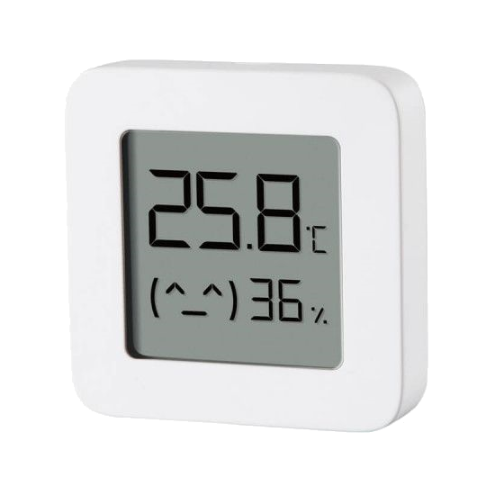

# MI32  
  
The MI32-driver focuses on the passive observation of BLE sensors of the Xiaomi/Mijia universe, thus only needing a small memory footprint. This allows to additionally run a dedicated software bridge to Apples HomeKit with very few additional configuration steps. Berry can be used in parallel.

   
## Tasmota and BLE-sensors

Different vendors offer Bluetooth solutions as part of the XIAOMI family often under the MIJIA-brand (while AQUARA is the typical name for a ZigBee sensor).  
The sensors supported by Tasmota use BLE (Bluetooth Low Energy) to transmit the sensor data, but they differ in their accessibilities quite substantially.  
  
Basically all of them use of so-called „MiBeacons“ which are BLE advertisement packets with a certain data structure, which are broadcasted by the devices automatically while the device is not in an active bluetooth connection.  
The frequency of these messages is set by the vendor and ranges from one per 3 seconds to one per hour (for the battery status of the LYWSD03MMC). Motion sensors and BLE remote controls start to send when an event is triggered.  
These packets already contain the sensor data and can be passively received by other devices and will be published regardless if a user decides to read out the sensors via connections or not. Thus the battery life of a BLE sensor is not influenced by reading these advertisements and the big advantage is the power efficiency as no active bi-directional connection has to be established. The other advantage is, that scanning for BLE advertisements can happen nearly parallel (= very quick one after the other), while a direct connection must be established for at least a few seconds and will then block both involved devices for that time.  
This is therefore the preferred option, if technically possible (= for the supported sensors).
  
Most of the „older“ BLE-sensor-devices use unencrypted messages, which can be read by all kinds of BLE-devices or even a NRF24L01. With the arrival of "newer" sensors came the problem of encrypted data in MiBeacons, which can be decrypted in Tasmota.  
Meanwhile it is possible to get the needed "bind_key" without the need to use Xiaomis apps and server infrastructure.  
At least the LYWSD03 allows the use of a simple BLE connection without any encrypted authentication and the reading of the sensor data using normal subscription methods to GATT-services (currently used on the HM-1x). This is more power hungry than the passive reading of BLE advertisements. It is not directly supported by the driver anymore, but can be realized in Berry, i.e. to read the correct battery status.   
Other sensors like the MJYD2S and nearly every newer device are not usable without the "bind_key".  
  
The idea is to provide as many automatic functions as possible. Besides the hardware setup, there are zero or very few things to configure.  
The sensor namings are based on the original sensor names and shortened if appropriate (Flower care -> Flora). A part of the MAC will be added to the name as a suffix.  
All sensors are treated as if they are physically connected to the ESP32 device. For motion and remote control sensors MQTT-messages will be published in (nearly) real time.
  
### Supported Devices

!!! note "It can not be ruled out, that changes in the device firmware may break the functionality of this driver completely!"  

The naming conventions in the product range of bluetooth sensors in XIAOMI-universe can be a bit confusing. The exact same sensor can be advertised under slightly different names depending on the seller (Mijia, Xiaomi, Cleargrass, ...).

 <table>
  <tr>
    <th class="th-lboi">MJ_HT_V1</th>
    <th class="th-lboi">LYWSD02</th>
    <th class="th-lboi">CGG1</th>
    <th class="th-lboi">CGD1</th>
  </tr>
  <tr>
    <td class="tg-lboi"></td>
    <td class="tg-lboi"></td>
    <td class="tg-lboi"></td>
    <td class="tg-lboi"></td>
  </tr>
  <tr>
    <td class="tg-lboi">temperature, humidity, battery</td>
    <td class="tg-lboi">temperature, humidity, battery</td>
    <td class="tg-lboi">temperature, humidity, battery</td>
    <td class="tg-lboi">temperature, humidity, battery</td>
  </tr>
    <tr>
    <td class="tg-lboi">passive for all entities, reliable battery value</td>
    <td class="tg-lboi">battery only active, set clock and unit, very frequent data sending</td>
    <td class="tg-lboi">passive for all entities, reliable battery value</td>
    <td class="tg-lboi">battery only active, no reliable battery value, no clock functions</td>
  </tr>
</table>  
  
 <table>
  <tr>
    <th class="th-lboi">MiFlora</th>
    <th class="th-lboi">LYWSD03MMC / ATC</th>
    <th class="th-lboi">NLIGHT</th>
    <th class="th-lboi">MJYD2S</th>
  </tr>
  <tr>
    <td class="tg-lboi"></td>
    <td class="tg-lboi"></td>
    <td class="tg-lboi"></td>
    <td class="tg-lboi"></td>
  </tr>
  <tr>
    <td class="tg-lboi">temperature, illuminance, soil humidity, soil fertility, battery, firmware version</td>
    <td class="tg-lboi">temperature, humidity, battery</td>
    <td class="tg-lboi">motion</td>
    <td class="tg-lboi">motion, illuminance, battery, no-motion-time</td>
  </tr>
  <tr>
    <td class="tg-lboi">passive only with newer firmware (>3.0?), battery only active</td>
    <td class="tg-lboi">passive only with decryption or using custom ATC-firmware, no reliable battery value with stock firmware</td>
    <td class="tg-lboi">passive</td>
    <td class="tg-lboi">passive only with decryption</td>
  </tr>
</table>  
  
 <table>
  <tr>
    <th class="th-lboi">YEE RC</th>
    <th class="th-lboi">MHO-C401</th>
    <th class="th-lboi">MHO-C303</th>
    <th class="th-lboi">MCCGQ02HL</th>
  </tr>
  <tr>
    <td class="tg-lboi"></td>
    <td class="tg-lboi"></td>
    <td class="tg-lboi"></td>
    <td class="tg-lboi"></td>
  </tr>
  <tr>
    <td class="tg-lboi">button press (single and long)</td>
    <td class="tg-lboi">temperature, humidity, battery</td>
    <td class="tg-lboi">temperature, humidity, battery</td>
    <td class="tg-lboi">contact opening/closing, battery</td>
  </tr>
     <tr>
    <td class="tg-lboi">passive</td>
    <td class="tg-lboi">equal to the LYWS03MMC</td>
    <td class="tg-lboi">passive for all entities,  set clock and unit, no alarm functions, very frequent data sending</td>
    <td class="tg-lboi">passive only with decryption</td>
  </tr>
</table>

 <table>
  <tr>
    <th class="th-lboi">SJWS01L</th>
  </tr>
  <tr>
    <td class="tg-lboi"></td>
  </tr>
  <tr>
    <td class="tg-lboi">button press (single and long), leak alarm, battery</td>
  </tr>
     <tr>
    <td class="tg-lboi">passive only with decryption</td>
  </tr>
</table> 
passive: data is received via BLE advertisments  
active: data is received via bidrectional connection to the sensor  
  
#### Devices with payload encryption  
  
The encrypting devices will start to send advertisements with encrypted sensor data after pairing it with the official Xiaomi app. Out-of-the-box the sensors do only publish a static advertisement.  
It is possible to do a pairing and get the necessary decryption key ("bind_key") right here in the Wiki. This method uses the same code base as the first published working example: https://atc1441.github.io/TelinkFlasher.html  
This project also provides a custom firmware for the LYWSD03MMC, which then becomes an ATC and is supported by Tasmota too. Default ATC-setting will drain the battery more than stock firmware, because of very frequent data sending.  
This key and the corresponding MAC of the sensor can be injected with the MI32key-command (or NRFMJYD2S), but the new and recommended option is tu use a **mi32cfg** file.

It is still possible to save the whole config as RULE like that:  (not recommended anymore!)
  
```haskell
rule1 on System#Boot do backlog MI32key 00112233445566778899AABBCCDDEEFF112233445566; MI32key 00112233445566778899AABBCCDDEEFF112233445566 endon
```  
(key for two sensors)  
   
  
## MI32 Configuration
  
There are several ways to manage ad save your configuration. 

1. Do it on the device
Starting after a fresh install the driver will not find a configuration file and begins to search for every BLE device, that he can unterstand. Thus after a while all BLE sensors in sight should have been added to the non-persistent internal memory.  
You can save them with command `MI32CFG`, which will create a JSON-file named 'mi32cfg' in the root folder of the internal flash of the ESP32. After the next reboot, the driver will read this configuration into memory and does not add more devices to this list.  
  
2. Create the mi32cfg file manually  
After a fresh install you can simply create a file in the root folder of the flash file system with the name 'mi32cfg' and paste the JSON into it. Save it and reboot.

3. Adding sensors including the keys directly on this page  
It is recommended to paste the data of 'mi32cfg' into the next textfield, if you already have one. After that press IMPORT MI32CFG. The config will get parsed and presented in a table.  
  
### MI32CFG Importer - Web App

<p>MI32CFG <span id='importedDev'>- nothing imported yet</span></p>
<input size="56" type="text" id="result_config" value="" placeholder="paste your mi32cfg here"><br>
<button type="button" class="md-button md-button--primary" onclick="importCfg();">Import MI32Cfg</button>


<div class="tabbed-set tabbed-alternate" data-tabs="2:2"><input checked="checked" id="__tabbed_2_1" name="__tabbed_2" type="radio"><input id="__tabbed_2_2" name="__tabbed_2" type="radio"><div class="tabbed-labels">
<label for="__tabbed_2_1">Table</label>
<label for="__tabbed_2_2">JSON</label></div> 
<div class="tabbed-content"><div class="tabbed-block"> <div class="highlight"><pre id="__code_4">
<div class="md-typeset__scrollwrap"><div class="md-typeset__table">
<table  id="oldMi32Cfg"></table>
</div></div>
</pre></div> </div> 
<div class="tabbed-block"> <div class="highlight"><pre id="__code_5"><span></span><button class="md-clipboard md-icon" title="Copy to clipboard" data-clipboard-target="#__code_5 > code"></button><code id="exportedJSON"><span  class="cp">[]</span>
</code></pre></div> </div> </div> </div>


  
After that you can add more sensors with the following Bind Key Generator, which will also add sensors, that do not need a key. This will only work, if your browser supports this and **should work with Opera, Chrome and Edge**. Safari and Firefox are not able to do this.  
After succesful pairing a sensor in the next step or simply connecting to a non-encrypting sensor, the JSON in the textfield above will be update with the added new sensor at the bottom. 
You can copy-paste the new JSON via the Web-GUI to the mi32cfg file on the ESP32 or save it elsewhere. For adding more sensors, repeat the whole procedure after refreshing the site (after saving your data!!).  

### Bind Key Generator - Web App  

<div id='bind_key_section'>
99% of the work was done by: https://atc1441.github.io/TelinkFlasher.html !!  
<div class="admonition danger"> <p class="admonition-title">Will disable device in MiHome</p><p>When doing an activation here the device is needed to be activated in the Mi app again when wanted to use there.</p> </div>
<button type="button" class="md-button md-button--primary" onclick="connect();">Connect</button>
<label for="instantPair"> Pair instantly</label>
<input type="checkbox" id="instantPair"><br>
<label for="namePrefix">BLE device name prefix filter(s)</label>
<div id="MI32_status"></div>
<input type="text" id="namePrefix" value="" placeholder="MHO-C401,LYWSD03"><br>

<button type="button" class="md-button md-button--primary connected" onclick="reConnect();">Reconnect</button>
<button type="button" class="md-button md-button--primary connected" onclick="reload_page();">Reset Page</button>
<button type="button" class="md-button md-button--primary connected" onclick="disconnect();">Disconnect</button>

<label id="device_tip"></label>

<h3 id="device_name"></h3>  
<!-- <div id="tempHumiData" class="connected"></div><hr> -->

<div class="connected">
<div id='connected_device'></div>
Device known id:
<input size="34" type="text" id="known_id" value="">
Mi Token:
<input size="34" type="text" id="mi_token" value=""><br>
Mi Bind Key:
<input size="34" type="text" id="mi_bind_key" value="">
MAC:
<input size="34" type="text" id="MAC" value=""><br>
<button type="button" class="md-button md-button--primary" onclick="sendRegister();">Do Activation</button><br>
</div>

<button type="button" class="md-button md-button--primary"onclick="clearLog();">Clear Log</button><br>
<div id="result"></div>
</div>

??? summary "BLE-Log:"
  
     .

  
## Commands

Command|Parameters
:---|:---
MI32Cfg<a id="mi32cfg"></a>|Saves current sensor list as **mi32cfg** file to the flash of the ESP32. After reboot only the saved drivers will be observed, no unknown drivers will be added. A valid config file is mandatory for HomeKit in this driver.
MI32Key<a id="mi32key"></a>| Set a "bind_key" for a MAC-address to decrypt sensor data (LYWSD03MMC, MJYD2S). The argument is a 44 uppercase characters long string, which is the concatenation of the bind_key and the corresponding MAC.<BR>`<00112233445566778899AABBCCDDEEFF>` (32 characters) = bind_key<BR>`<112233445566>` (12 characters) = MAC of the sensor<BR>`<00112233445566778899AABBCCDDEEFF112233445566>` (44 characters)= final string
MI32Option0<a id="mi32option"></a>|`0` = sends only recently received sensor data<br>`1` = aggregates all recent sensors data types
MI32Option1|`0` = shows full sensor data at Teleperiod<br>`1` = shows no sensor data at Teleperiod
MI32Option2|`0` = sensor data only at Teleperiod (_default_)<br>`1` = direct bridging of BLE data to MQTT messages
MI32Option3|`0` = do not add new sensors, which is set after a valid **mi32cfg** file is parsed after boot (_default_)<br>`1` = turn on auto-adding of new sensors again

!!! tip 
If you really want to read battery for LYWSD02, Flora and CGD1, consider doing it in Berry.


!!! tip 
If you want to add a new BLE sensor to your config on the device, use `MI32option3 1` to add the new sensor by catching a BLE packet. Then use `MI32Cfg` to save the new config on flash.
  

## HomeKit Bridge
  
If activated at compile time the driver will start the HAP core (= the main task of the HomeKit framework) after succesfully reading a valid **mi32cfg** file after the start. It will create a 'bridge accessory' presenting all configured BLE devices to HomeKit. You can add the ESP32 as such a **Mi-Home-Bridge** to HomeKit in the native way, like you would add a commercial product to you local HomeKit network. The setup key is derived from the Wifi MAC of your ESP32 to easily allow many ESP32 to be used as a HomeKit bridge in your local network. Besides the driver will also manage up to four relays and sync them with HomeKit. There is nothing more to configure, the driver will automatically translate the data packets back and forth.  
It just works ... except, when it does not.

!!! danger "Known issues"

    The underlying HAP framework will expose incompatible network configurations, which will likely be related to mDNS and IGMP settings. There is nothing, that the Tasmota side can fix here.

!!! danger "If it is not broken, do not upgrade"

    Although the driver does not write to the NVS section and the usage of a modified HAP framework (using a NVS wrapper) the behavior of Tasmota firmware upgrades is undefined with regards to a working HomeKit installation. Similar things can also happen using much bigger projects like "Homebridge". So it might be necessary to completely erase the Mi-Bridge from your "Home" in Homekit and doing a flash erase of the ESP32 after a firmware upgrade of the ESP32. It is recommend to first create a final mi32cfg file before you add the Mi-Home-Bridge to your "Home".

   
## Berry support  

The driver provides two Berry classes to allow extensions and interactions with the sensors. It is also possible to write generic BLE functions unrelated to Xiaomi sensors.  
  
### MI32 class
To access and modify the Xiaomi sensor data the `MI32` class is provided.  
First we need an instance, like so:  
`m = MI32()` 
  
We have the following methods, which are chosen to be able to replace the old commands MI32Battery, MI32Unit and MI32Time (using instance `m`):  

- `m.devices()`: returns the number of monitored Xiaomi devices
- `m.get_name(x)`: returns a string with the sensor name (internal name of the driver) at slot x in the internal sensor array of the driver
- `m.get_MAC(x)`: returns a byte buffer (6 bytes) representing the MAC at slot x in the internal sensor array of the driver
- `m.set_bat(x,v)`:  sets the battery value to v at slot x in the internal sensor array of the driver
- `m.set_hum(x,v)`:  sets the humidity value to v at slot x in the internal sensor array of the driver
- `m.set_temp(x,v)`:  sets the temperature value to v at slot x in the internal sensor array of the driver
  
### BLE class
  
For generic BLE access we have `BLE`, which is instantiated as before.  
`ble = BLE()`
  
To simplify BLE access this works in the form of state machine, where you have to set some properties and then finally launch an operation. Besides we have two callback mechanisms for listening to advertisements and active sensor connections. Both need a byte buffer in Berry for data exchange and a Berry function as the callback.  
To listen to advertisements inside a class (that could be a driver) we could initialize like that:

!!! example "Simple Advertisement Listener"

  ```python
  var ble, cbp, buf
  def init()
      self.buf = bytes(-64)
      self.cbp = tasmota.gen_cb(/-> self.cb())
      self.ble = BLE()
      self.ble.adv_cb(self.cbp,self.buf)
  end

  def cb()
    print(buf) # simply prints out the byte buffer of an advertisement packet
  end
  ```

To stop listening call:  
`self.ble.adv_cb(0)`
  
We just have to provide a pointer to a (callback) function and a byte buffer.  The returned data in the byte buffer uses the following proprietary format:  
```haskell
6 bytes - MAC
2 bytes - SVC
1 byte  - RSSI
1 byte  - length of service data in bytes (maybe zero!!)
n bytes - service data (i.e. payload of the Xiaomi sensors) if present - if 
          NOT the first byte is the length of manufacturer data in bytes 
if(no service data):
  1 byte  - length of manufacturer data (maybe zero too!!)
  n bytes - manufacturer data (i.e. iBeacon data)
```

  
Communicating via connections is a bit more complex. We have to start with a callback function and a byte buffer again.  
```python
ble = BLE()
cbuf = bytes(-64)

def cb()
end

cbp = tasmota.gen_cb(cb)
ble.conn_cb(cbp,cbuf)
```
  
Internally this creates a context, that can be modified with the follwing methods:
  
Set the MAC of the device we want to connect to:  
`ble.set_MAC(mac)`: where mac is a 6-byte-buffer  
  
Set service and characteristic:  
`ble.set_svc(string)`: where string is a 16-Bit, 32-Bit or 128-Bit service uuid  
`ble.set_chr(string)`: where string is a 16-Bit, 32-Bit or 128-Bit characteristic uuid  

Finally run the context with the specified properties and (if you want to get data back to Berry) have everything prepared in the callback function: 
`ble.run(operation)`: where operation is a number, that represents an operation in a proprietary format. Current implemention disconnects after every operation:

- 11 - read  
- 12 - write  
- 13 - notify read  
  
The buffer format for reading and writing is in the format:
```
1 byte  - length of data in bytes
n bytes - data
```

Here is an example for setting the time of a sensor as a replacement for the old MI32Time command:  
!!! example "MI32Time in Berry"

  ```python
  ble = BLE()
  m = MI32()
  sl = 0

  cbuf = bytes(-64)
  def cb()
    # nothing to be done here
  end

  cbp = tasmota.gen_cb(cb)
  ble.conn_cb(cbp,cbuf)

  def SetMACfromSlot(slot)
      if slot+1>m.devices()
          return "out of bounds"
      end
      sl = slot
      var _m = m.get_MAC(slot)
      ble.set_MAC(_m)
  end

  def MI32Time(slot)
      SetMACfromSlot(slot)
      ble.set_svc("EBE0CCB0-7A0A-4B0C-8A1A-6FF2997DA3A6")
      ble.set_chr("EBE0CCB7-7A0A-4B0C-8A1A-6FF2997DA3A6")
      cbuf[0] = 5
      var t = tasmota.rtc()
      var utc = t.item("utc")
      var tz = t.item("timezone")/60
      cbuf.set(1,utc,4)
      cbuf.set(5,tz,1)
      ble.run(12)
  end
  ```


*[HAP]: HomeKit Accessory Protocol
*[NVS]: Non Volatile Storage
*[mDNS]: multicast DNS
*[IGMP]: Internet Group Management Protocol
*[BLE]: Bluetooth Low Energy
*[Berry]: Berry Script Language