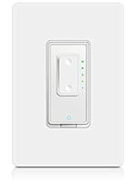
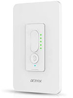
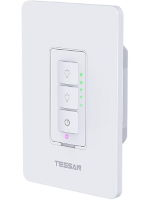
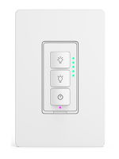
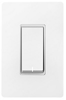
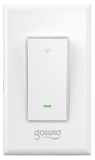

# PWM Dimmer

!!! info "PWM dimmer is supported in standard tasmota.bin"
      To enable PWM dimmer operation, select the PWM Dimmer module.

PWM Dimmer module adds support for PWM dimmer switches and devices with one or more buttons that control devices in a device group. The brightness of the load for PWM dimmers is controlled by a PWM GPIO pin. They typically have power, up and down buttons, a powered-on LED, five brightness LEDs and another status LED. The SD0x dimmer from Martin Jerry, Acenx, Tessan or NTONPOWER is an example of such a device.

Any other device with one or more buttons, such as any typical Tasmota-capable wall switch, can make use of the PWM Dimmer module to control the power, brightness and light channels of one or more device groups. For single-button devices or multi-button devices with remote device mode enabled, only the operations controlled by the power button in the instructions below apply. Examples include:

## PWM Dimmer Operation

Pressing and releasing the power button toggles the power on/off. If the toggle turns the power on, the light is returned to the last brightness it was set to. If `Fade` is enabled, the light is faded on/off at the rate defined by the `Speed` setting.

When the power is on, holding the down or up button decreases/increases the brightness. The brightness can also be changed using just the power button. When the power is on, holding the power button alternately increases or decreases the brightness. Initially, holding the power button increases the brightness. Releasing and then holding the power button again decreases the brightness.

When the power is off, pressing and releasing the down or up button turns the power on at a temporary brightness of the low/high levels set by the `BriPreset` command. Turning the power on at the low preset can also be accomplished by holding the power button while the power is off. The brightness presets are intended to enable quickly turning on a light to a dim or bright level without changing the normal desired brightness. Turning the power on to a preset does not change the brightness the light will be set to when the switch is turned on the next time. For example, if the light is on and you adjust the brightness to 80 and then turn the light off, when you turn it back on, the brightness will return to 80. If you turn the power off again and then press the down button, the light will be turned on at the brightness defined by the low preset. If you then turn the light off and on again, the brightness will return to 80.

If there are LEDs defined in the template, they are turned on to indicate the current brightness. More LEDs are turned on at higher brightnesses. `SetOption86` enables/disables the LED timeout. If `SetOption86` is enabled, the LEDs turn off five seconds after the last change in brightness. Note that the lowest LED and the blue power LED are always on when the power is on. The LED timeout can also be enabled/disabled by holding the power button while tapping (pressing and releasing quickly) the down button.

The LedLink LED can be used as a nightlight/powered-off indicator. `SetOption87` enables/disables turning the LedLink LED on when the power is off. The powered-off indicator can also be enabled/disabled by holding the power button and tapping the up button.

Holding the power button and then holding the down or up button publishes an MQTT EVENT command. The topic follows the format of the Full Topic with a subtopic of EVENT (ex. `cmnd/LightSwitch1/EVENT`). The MQTT payload is `Trigger#`, where # is 1 if the down button is held or 2 if the up button is held. These triggers can be used in rules on remote devices (`ON Event#Trigger1`) or by automation software to trigger automations such as scene changes. For example, the Event topic Trigger1 payload could trigger the automation software to turn on the previous scene in a list and the Trigger2 payload could trigger the automation software to turn on the next scene in a list.

Holding the power button, tapping the down button and then tapping or holding the down or up button sends a device group message to set CW/RGB/RGBW/RGBCW lights in the device group to the previous/next fixed color. The command is sent/value is adjusted once every .75 seconds for as long as the button is held. The color sequence is red, green, blue, orange, light green, light blue, amber, cyan, purple, yellow, pink, white using RGB channels; cold white using CT channels; and warm white using CT channels.

Holding the power button, tapping the up button and then tapping or holding the down or up button publishes an MQTT Event command. The command is sent once every .75 seconds for as long as the button is held. The MQTT topic is as described above. The MQTT payload is `Trigger#`, where # is 3 if the down button is held or 4 if the up button is held.

Pressing and releasing the power button and then holding the power button publishes an MQTT Event command. The command is sent once every .75 seconds for as long as the button is held. The MQTT topic is as described above. The MQTT payload is `Trigger#`, where # is 5.

Button presses and holds execute the normal ButtonTopic and Rule processing. If `ButtonTopic` is set and `SetOption61` is 0 or a the button press/hold matches a rule, the button press/hold is ignored by PWM Dimmer. Operations invoked by holding the power button in combination with the up/dowm buttons cannot be overridden by rules. Standard Tasmota multi-press button presses operate as normal.

PWM Dimmer uses the Light module to control the PWM. Brightness levels are rescaled to PWM values between the `dimmer_min` and `dimmer_max` values specified with [DimmerRange](Commands.md#dimmerrange). Most LED bulbs do not show a significant difference between PWM value of 1 and PWM value of 100. This results in the lower 10% of the dimmer range having no effect. For best results, `DimmerRange <dimmerMin>` value should be set to the highest value that results in the lowest bulb brightness (Typically in the range of 8 - 18).

When Device Groups are enabled, the PWM Dimmer brightness presets are kept in sync across all switches in the group. The powered-off LED and LED timeout settings are specific to each switch. Changing them does not replicate the change to the other switches in the group.

When CW/RGB/RGBW/RGBCW lights are in the same device group as the PWM Dimmer device, use the `PWMDimmerPWMs` command to define the PWM (channel) count of the lights. This allows the PWM Dimmer module to correctly determine the brightness (dimmer) level and allows the color of all the lights in the device group to be controlled from the PWM Dimmer device.

## Commands

Command|Parameters
:---|:---
BriPreset|`<low>,<high>` = set brightness low and high presets `1..255` = set brightness preset `+` = increase brightness preset `-` = decrease brightness preset
LedMask|Set a bitmask specifiying which LEDs are used to indicate the current brightness. LEDs not included in the bitmask can be controlled with [LedPower<x>](Commands.md#ledpower). `<bitmask>` = bitwise value representing each LED. Values may be entered as either hexadecimal or decimal values (e.g., 0xFFFF = 65535). Note that LED 0 is tied to the relay and is always used to indicate the first level of brightness. 0xFFFF (= 1111 1111 1111 1111) All LEDs are used to indicate the  brightness (default) Ex.: LedMask 3 = Use LEDs 0, 1 and 2 to indicate the brightness.
PWMDimmerPWMs|Set the PWM (channel) count of lights in the device group controlled by the module (CW=2, RGB=3, RGBW=4, RGBCW=5).
SetOption86|Set brightness LED timeout `0` = disable timeout (default) `1` = enable timeout
SetOption87|Set powered-off LED (nightlight) `0` = disable powered-off LED (default) `1` = enable powered-off LED
SetOption88|Set remote device mode `0` = disable remote device mode(default) `1` = enable remote device mode

## Remote Device Mode

Remote device mode allows PWM Dimmer switches to control remote devices. With remote device mode enabled, each button controls a different device.

Remote device mode is included in the default Tasmota binary. To include remote device mode support in other builds, define `USE_PWM_DIMMER_REMOTE` and `USE_DEVICE_GROUPS` in your user_config_override. Remote device mode support requires [device group](Device-Groups.md) support. Remote device mode support adds 1K to the code size in addition to the code size required for device groups support.

To enable remote device mode, execute `SetOption88 1` (the device will restart). Each remote device must be running firmware with device group support and have remote device support enabled. Remote devices do not need to be built with PWM Dimmer support nor do they need to be switches.

If a remote device also uses the PWM Dimmer module, the device acts like a 3-way dimmer switch and may or may not have a load connected to it. All PWM Dimmer switches in the device group can control the power, brightness and color of one or more smart lights with Tasmota with device group support loaded on them.

When remote device mode is enabled, button 1 is the power button for the local device while buttons 2 and 3 are the power buttons for remote devices. Group names for buttons 2 and 3 are set by the `DevGroupName2` and `DevGroupName3` commands respectively. Note that the button numbers are defined by the module template and can be in any physical order on the switch (button 1 can be defined as the top button, the middle button or the bottom button). Button combinations that publish MQTT Event commands use a topic in the format `cmnd/%group-topic%/EVENT`.

While holding a button, the other two buttons act like the down and up buttons for the remote device associated with the first button pressed. All the functions performed by the down and up buttons in non-remote device mode are available in remote device mode. While holding button 1, button 2 performs the functions of the down button and button 3 performs the functions of the up button. While holding button 2, button 1 performs the functions of the down button and button 3 performs the functions of the up button. While holding button 3, button 1 performs the functions of the down button and button 2 performs the functions of the up button.
