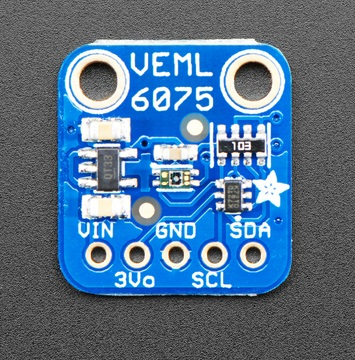

# VEML6075 UVA/UVB/UVINDEX Sensor

!!! failure "This feature is not included in precompiled binaries"     

To use it you must [compile your build](Compile-your-build). Add the following to `user_config_override.h`:
```
#ifndef USE_VEML6075
#define USE_VEML6075            // Add I2C code for VEML6075 sensor
#endif
```
----


This little sensor is a great way to add UVA and UVB light sensing to any microcontroller project. The VEML6075 from Vishay has both true UVA and UVB band light sensors and an I2C-controlled ADC that will take readings and integrate them. The sensor also comes with calibration registers so you can easily convert the UVA/UVB readings into the UV Index.

## Configuration

### Wiring
| VEML6075   | ESP8266  |
|---|---|
|GND   |GND   |
|VCC   |3.3V 
|SDA   | GPIOx
|SCL   | GPIOy

### Tasmota Settings 
In the **_Configuration -> Configure Module_** page assign:

1. GPIOx to `I2C SDA (6)`
2. GPIOy to `I2C SCL (5)`

## Commands and Use

 Console Commands    | Description                                             | values     |
---------------------|---------------------------------------------------------|------------|
 VEML6075power       | Power on/off the modul                                  |  0/1
 VEML6075inttime     | UV integration time (50ms, 100ms, 200ms, 400ms, 800ms)  | 0/1/2/3/4
 VEML6075dynamic     | dynamic setting (low, high)                             | 0/1


### Tasmota Main
After a reboot the driver will detect VEML6075 automatically and display UVA/UVB/UVindex intensity.


## Breakout Boards


